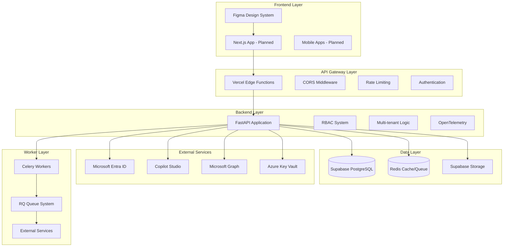
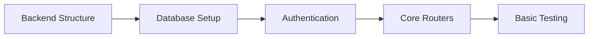
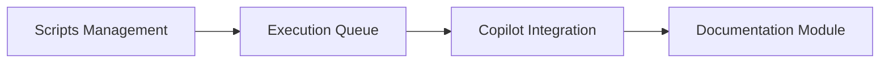
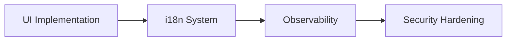
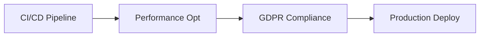

# 🎯 HAIDA - Especificación Técnica Completa

## 📋 Resumen Ejecutivo

**HAIDA** es una plataforma integral de Testing/Auditoría QA con IA integrada, diseñada para automatizar y optimizar procesos de calidad de software en entornos empresariales multi-tenant.

### 🎯 Visión

Convertir HAIDA en la plataforma de referencia para Quality Assurance inteligente, combinando automatización tradicional con IA avanzada para entregas de software más rápidas, confiables y escalables.

### 🏗️ Arquitectura

- **Backend**: FastAPI (Python) + Supabase (PostgreSQL)
- **Frontend**: Next.js (planeado) + Design System Figma
- **Autenticación**: Entra ID SSO + Local JWT
- **IA**: Copilot Studio + OpenAI (opcional)
- **Infra**: Vercel (ASGI) + Redis (jobs/cache)
- **Seguridad**: RLS + RBAC + Rate Limiting + Audit

---

## 🏛️ ARQUITECTURA GENERAL

### Componentes Principales



### Decisiones Arquitectónicas

| Aspecto               | Decisión             | Justificación                                                          |
| --------------------- | -------------------- | ---------------------------------------------------------------------- |
| **Backend Framework** | FastAPI              | Alto rendimiento, async-first, OpenAPI auto-generado, comunidad activa |
| **Database**          | Supabase PostgreSQL  | RLS nativo, real-time, edge functions, escalabilidad automática        |
| **Authentication**    | Entra ID + Local JWT | SSO enterprise-grade + flexibilidad para usuarios externos             |
| **Queue System**      | RQ + Redis           | Simplicidad vs Celery, adecuado para workloads moderados               |
| **IA Integration**    | Copilot Studio       | Microsoft ecosystem, Direct Line API, enterprise security              |
| **Deployment**        | Vercel               | Serverless, edge computing, integración con Git                        |
| **Monitoring**        | OpenTelemetry        | Estándar industry, múltiples backends, auto-instrumentación            |

---

## 📊 MODELADO DE DATOS

### Arquitectura Multi-tenant

```
auth.users (Supabase Auth)
    ↓ extends
user_profiles
    ↓ belongs_to
tenant_members ← tenants
    ↓ owns
projects
    ↓ contains
test_suites → test_cases
    ↓ executes
test_executions → test_results
```

### Entidades Principales

#### 👥 Usuarios y Autenticación

- **auth.users**: Base authentication (Supabase)
- **user_profiles**: Extended profile information
- **user_sso_providers**: SSO provider linkages
- **tenant_members**: User-tenant relationships

#### 🏢 Tenants y RBAC

- **tenants**: Workspace/organization entities
- **roles/permissions**: RBAC system
- **role_permissions**: Role-permission mappings

#### 🚀 Feature Flags

- **feature_flags**: Global feature definitions
- **tenant_feature_flags**: Tenant-specific overrides
- **user_feature_flags**: User-specific overrides

#### 📊 Testing y QA

- **projects**: Applications under test
- **test_suites**: Test suite definitions
- **test_cases**: Individual test cases (ISTQB compliant)
- **test_executions**: Test run instances
- **test_results**: Individual test outcomes

#### 🤖 Automation

- **change_detections**: Web change monitoring
- **scripts**: Automation scripts repository
- **script_runs**: Script execution tracking

#### 📚 Documentation

- **docs**: Documentation entries
- **doc_versions**: Versioned content
- **doc_search_index**: Full-text search

#### 💬 IA y Chat

- **chat_threads**: Conversation threads
- **chat_messages**: Message history
- **chat_providers**: IA provider configurations

#### 📈 Reports y Analytics

- **reports**: Generated reports
- **report_templates**: Report configurations
- **Views**: v_project_health, v_test_coverage, v_recent_executions

### Relaciones Clave

```
auth.users
├── 1:1 → user_profiles
├── 1:N → tenant_members
├── 1:N → user_sso_providers
└── 1:N → [audit_log, system_events]

tenants
├── 1:N → tenant_members
├── 1:N → projects
├── 1:N → docs
├── 1:N → chat_threads
├── 1:N → scripts
└── 1:N → reports

projects
├── 1:N → test_suites
├── 1:N → test_executions
├── 1:N → change_detections
├── 1:N → docs
├── 1:N → chat_threads
└── 1:N → scripts

test_suites
├── 1:N → test_cases
└── 1:N → test_executions

test_executions
└── 1:N → test_results

scripts
└── 1:N → script_runs
```

---

## 🔐 SEGURIDAD Y AUTENTICACIÓN

### Modelo de Seguridad

#### 1. Autenticación Multi-provider

```python
# Entra ID SSO (Primary)
@app.post("/entra/login")
async def entra_login(auth_code: str):
    token = await entra_client.get_token(auth_code)
    user = await entra_client.get_user_info(token)
    return create_session(user)

# Local JWT (Fallback)
@app.post("/auth/login")
async def local_login(credentials: LoginRequest):
    user = await authenticate_user(credentials)
    return create_jwt_token(user)
```

#### 2. Autorización RBAC

```python
# Permission checking
def has_permission(user_id: UUID, permission: str, tenant_id: UUID = None) -> bool:
    # Check user role in tenant
    # Check specific permission
    # Return boolean result
```

#### 3. Multi-tenant Isolation

```sql
-- RLS Policy Example
CREATE POLICY "tenant_data_isolation" ON projects
    FOR ALL USING (tenant_id IN (
        SELECT tenant_id FROM tenant_members
        WHERE user_id = auth.uid()
    ));
```

#### 4. Rate Limiting

```python
# Redis-based rate limiting
@app.middleware("http")
async def rate_limit_middleware(request, call_next):
    user_id = get_current_user_id(request)
    tenant_id = get_current_tenant_id(request)

    if not check_rate_limit(user_id, tenant_id, request.url.path):
        raise HTTPException(429, "Rate limit exceeded")

    return await call_next(request)
```

### Niveles de Seguridad

| Nivel | Componente     | Implementación                   |
| ----- | -------------- | -------------------------------- |
| **1** | Network        | Vercel WAF, Cloudflare           |
| **2** | Transport      | HTTPS/TLS 1.3                    |
| **3** | Authentication | Entra ID SSO + JWT               |
| **4** | Authorization  | RBAC + RLS                       |
| **5** | Application    | Input validation, XSS prevention |
| **6** | Data           | Encryption at rest, PII masking  |
| **7** | Audit          | Comprehensive logging            |

---

## 🔄 FLUJOS DE USUARIO PRINCIPALES

### 1. Onboarding y Setup

```
User Registration/Login
    ↓
Tenant Creation/Joining
    ↓
Project Setup
    ↓
Test Suite Configuration
    ↓
Ready for Testing
```

### 2. Test Execution Flow

```
Change Detection Webhook
    ↓
Test Suite Selection
    ↓
Environment Provisioning
    ↓
Test Execution (Parallel)
    ↓
Result Collection & Analysis
    ↓
Report Generation
    ↓
Notification Dispatch
```

### 3. Script Automation Flow

```
Script Creation/Upload
    ↓
Parameter Configuration
    ↓
Execution Trigger (Manual/API/Webhook)
    ↓
Queue Processing (Worker)
    ↓
Result Storage & Notification
```

### 4. Documentation Flow

```
Document Creation (Markdown)
    ↓
Version Control
    ↓
Review & Approval
    ↓
Publishing & Search Indexing
    ↓
Access Control & Auditing
```

### 5. IA Chat Flow

```
User Query
    ↓
Copilot Studio Processing
    ↓
Context Retrieval (Docs/Scripts/Tests)
    ↓
Response Generation
    ↓
Conversation History Storage
    ↓
Follow-up Suggestions
```

---

## 🛠️ MÓDULOS FUNCIONALES

### 1. Core System (`/app/core/`)

- **settings.py**: Configuration management
- **cors.py**: CORS configuration
- **rbac.py**: Role-based access control
- **tenants.py**: Multi-tenant resolution
- **limiter.py**: Rate limiting logic
- **otel.py**: Observability setup

### 2. Authentication (`/app/routes/auth.py`)

- Local JWT authentication
- Password reset flows
- Session management

### 3. Entra SSO (`/app/routes/entra.py`)

- OAuth2 flow implementation
- Token validation
- User provisioning

### 4. Tenants Management

- CRUD operations
- Member invitation/management
- Role assignment

### 5. Projects & Testing

- Project lifecycle management
- Test suite orchestration
- Execution monitoring
- Result analytics

### 6. Documentation System

- Markdown processing
- Version control
- Search functionality
- Access permissions

### 7. IA Chat Integration

- Copilot Studio connection
- Thread management
- Message history
- Provider switching

### 8. Scripts & Automation

- Script repository
- Execution queuing
- Result tracking
- Worker management

### 9. Reports & Analytics

- Template system
- Data aggregation
- Export functionality
- Dashboard metrics

---

## 🔌 INTEGRACIONES EXTERNAS

### Microsoft Ecosystem

```python
# Entra ID Authentication
entra_client = ConfidentialClientApplication(
    client_id=settings.ENTRA_CLIENT_ID,
    authority=settings.ENTRA_AUTHORITY
)

# Microsoft Graph API
graph_client = GraphServiceClient(
    credentials=credentials,
    scopes=settings.GRAPH_SCOPES
)

# Copilot Studio (Direct Line)
directline_client = DirectLineClient(
    secret=settings.DIRECT_LINE_SECRET
)
```

### Queue System (Redis/RQ)

```python
# Worker setup
redis_conn = Redis.from_url(settings.REDIS_URL)
queue = Queue('haida-jobs', connection=redis_conn)

# Job enqueue
job = queue.enqueue(run_test_suite, suite_id, environment)

# Worker processing
@queue.worker
def process_job(job):
    return execute_job_logic(job)
```

### Observability (OpenTelemetry)

```python
# Tracing setup
tracer = trace.get_tracer(__name__)

with tracer.start_as_current_span("test_execution"):
    span.set_attribute("suite.id", suite_id)
    span.set_attribute("tenant.id", tenant_id)
    # Execute tests
    results = await run_tests(suite)
    span.set_attribute("tests.count", len(results))
```

---

## 📈 ESCALABILIDAD Y PERFORMANCE

### Estrategias de Escalado

#### Horizontal Scaling

- **Database**: Supabase auto-scaling
- **API**: Vercel serverless functions
- **Workers**: Multiple RQ workers
- **Cache**: Redis clustering

#### Performance Optimizations

- **Database Indexes**: 50+ optimized indexes
- **Query Optimization**: Views for complex aggregations
- **Caching**: Redis for frequently accessed data
- **CDN**: Vercel Edge for static assets

### Métricas de Performance

| Componente          | Target | Current | Monitoring         |
| ------------------- | ------ | ------- | ------------------ |
| API Response Time   | <200ms | TBD     | OpenTelemetry      |
| Database Query Time | <50ms  | TBD     | Supabase Dashboard |
| Test Execution Time | <5min  | TBD     | Custom metrics     |
| Page Load Time      | <2s    | TBD     | Vercel Analytics   |

---

## 🚀 PLAN DE IMPLEMENTACIÓN

### Fase 1: Foundation (Semanas 1-2)



### Fase 2: Core Features (Semanas 3-4)



### Fase 3: Advanced Features (Semanas 5-6)



### Fase 4: Production (Semanas 7-8)



---

## 🧪 TESTING STRATEGY

### Testing Pyramid

```
E2E Tests (Playwright) - 10%
    ↓
Integration Tests (FastAPI) - 20%
    ↓
Unit Tests (pytest) - 70%
```

### QA Coverage Areas

- **Functional Testing**: All API endpoints
- **Security Testing**: Authentication, authorization, RLS
- **Performance Testing**: Load testing, stress testing
- **Accessibility**: WCAG AA compliance
- **Cross-browser**: Chrome, Firefox, Safari, Edge

### Automation Strategy

- **CI/CD**: Automated testing on every PR
- **Regression**: Daily full suite execution
- **Performance**: Weekly load testing
- **Security**: Monthly security scans

---

## 🔮 FUTURAS EXPANSIONES

### Short-term (3-6 months)

- Mobile applications (iOS/Android)
- Advanced AI features (test generation, defect prediction)
- Integration with more CI/CD platforms
- Custom dashboard builder

### Medium-term (6-12 months)

- Multi-cloud deployment options
- Advanced analytics and ML insights
- API marketplace for third-party integrations
- White-label solutions

### Long-term (1-2 years)

- Global CDN with edge computing
- Real-time collaboration features
- Advanced compliance frameworks
- AI-powered test maintenance

---

## 📋 CONCLUSIONES

### Fortalezas Arquitectónicas

- ✅ **Security First**: RLS + RBAC + Rate limiting
- ✅ **Scalable**: Multi-tenant + serverless
- ✅ **Modern Stack**: FastAPI + Supabase + Vercel
- ✅ **Enterprise Ready**: SSO + Audit + Compliance
- ✅ **AI Integrated**: Copilot Studio + future ML features

### Riesgos Mitigados

- ✅ **Vendor Lock-in**: Abstraction layers + open standards
- ✅ **Scalability**: Serverless + auto-scaling
- ✅ **Security**: Defense in depth approach
- ✅ **Performance**: Caching + optimization strategies

### Próximos Pasos Inmediatos

1. Implementar estructura de directorios `/app/`
2. Configurar FastAPI foundation
3. Implementar autenticación Entra ID
4. Crear core routers y middlewares
5. Establecer CI/CD pipeline básico

---

**Versión**: 2.0
**Fecha**: Diciembre 2025
**Estado**: Especificación Completa - Ready for Implementation
